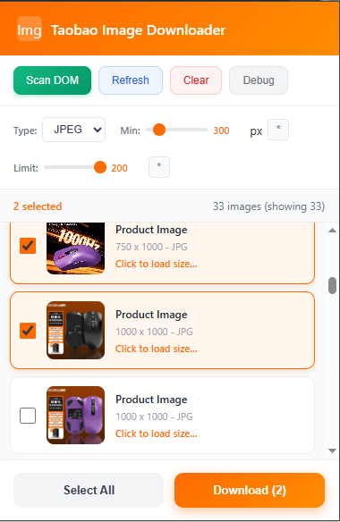

# Taobao Image Downloader

<p align="center">
  <a href="https://github.com/henglyrepo/Taobao-Image-Downloader/stargazers">
    
  </a>
  <a href="https://github.com/henglyrepo/Taobao-Image-Downloader/network/members">
    
  </a>
  <a href="https://github.com/henglyrepo/Taobao-Image-Downloader/releases">
    
  </a>
  
  <a href="https://chrome.google.com/webstore">
    
  </a>
</p>

<p align="center">
  <b>Download high-resolution product images from Taobao & Tmall with ease</b><br>
  A powerful, privacy-focused browser extension for e-commerce image harvesting
</p>

---

## ⭐ Features

| Feature | Description |
|---------|-------------|
| 🔍 **Smart Scanning** | Auto-captures images from Taobao/Tmall product pages via DOM scanning |
| 🖼️ **High Resolution** | Automatically upgrades thumbnails to full-resolution images |
| 📦 **Batch Download** | Download multiple images at once with one click |
| 🎯 **Smart Filters** | Filter by image type (JPEG/PNG/WebP), resolution, and quantity |
| 📝 **Auto-Naming** | Files automatically named using product title or ID |
| 🔒 **Privacy First** | All processing happens locally - no data sent to any server |
| ⚡ **Zero Dependencies** | Lightweight and fast - no bloat |

---

## 📸 Interface



---

## 🚀 Quick Start

1. **Install**: [Download latest release](https://github.com/henglyrepo/Taobao-Image-Downloader/releases) and load unpacked in Chrome/Edge
2. **Open**: Visit any Taobao or Tmall product page
3. **Scan**: Click the extension icon and wait for images (or click "Scan DOM")
4. **Filter**: Use filters to find exactly what you need
5. **Download**: Select images and click "Download"

---

## 📋 Controls

| Control | Function |
|---------|----------|
| **Scan DOM** | Manually scan the page for images |
| **Refresh** | Reload page and rescan |
| **Clear** | Clear cached images |
| **Debug** | View captured image URLs |
| **Type** | Filter by format (All/JPEG/PNG/WebP) |
| **Min** | Minimum resolution (0-2000px) |
| **Limit** | Max images to display (1-200) |

---

## 📁 Filename Format

```
{ProductTitle}_{number}.{extension}
```

**Examples:**
- `iPhone 15 Pro Max_1.jpg`
- `858036536367_1.png`

---

## 🔐 Permissions

This extension only accesses:

| Permission | Purpose |
|------------|---------|
| `activeTab` | Access current tab for scanning |
| `downloads` | Save images to your device |
| `storage` | Cache captured images locally |

### Host Permissions (Read-Only)

- `*.taobao.com`
- `*.tmall.com`
- `*.tmall.hk`
- `*.tbcdn.cn`
- `*.alicdn.com`
- `*.gtimg.cn`

> 🔒 **Privacy Guarantee**: We do NOT collect, transmit, or store any personal data. All processing happens locally in your browser.

---

## 🏗️ Architecture

```
┌─────────────────┐     ┌─────────────────┐     ┌─────────────────┐
│   content.js    │────▶│  background.js │────▶│    popup.js     │
│                 │     │                 │     │                 │
│  • DOM Scanner  │     │  • Storage      │     │  • UI Controller│
│  • Image Parser │     │  • Downloads    │     │  • Filters      │
└─────────────────┘     └─────────────────┘     └─────────────────┘
```

---

## 💻 Tech Stack

- **Language**: Vanilla JavaScript (ES6+)
- **Platform**: Chrome Extension (Manifest V3)
- **UI**: HTML5 + CSS3
- **Dependencies**: None

---

## 🤝 Contributing

```bash
# Clone the repository
git clone https://github.com/henglyrepo/Taobao-Image-Downloader.git

# Create a feature branch
git checkout -b feature/your-feature-name

# Make your changes
git add .
git commit -m "Add your feature"

# Push and create PR
git push origin feature/your-feature-name
```

---

## ❓ FAQ

### Why are no images captured?
- Make sure you're on a Taobao or Tmall product page
- Try clicking "Scan DOM" to manually trigger scanning
- Use Debug button to see captured URLs

### Does this work on mobile?
No, this is a desktop browser extension for Chrome/Edge only.

### Is my data safe?
Absolutely! No data is collected or transmitted. All processing is local.

### Can I download all images at once?
Yes! Click "Select All" then "Download". The limit slider controls displayed images (max 200).

---

## ⚠️ Disclaimer

**IMPORTANT - READ BEFORE USE:**

1. **Not Affiliated**: This extension is NOT affiliated with, endorsed by, or connected to Alibaba, Taobao, Tmall, or any of their subsidiaries.

2. **Terms of Service**: Use of this extension may violate the terms of service of Taobao/Tmall. This tool is provided for **educational and personal use only**.

3. **Copyright Notice**: 
   - Images downloaded using this tool may be protected by copyright laws
   - Users are solely responsible for ensuring they have the right to download and use images
   - Do NOT use this tool for commercial purposes without proper authorization
   - Please respect intellectual property rights

4. **No Warranty**: This software is provided "as is" without warranty of any kind. Use at your own risk.

5. **Liability**: The author(s) of this extension shall not be held liable for any damages or legal consequences arising from the use of this tool.

**By using this extension, you agree to these terms.**

---

## 📄 License

MIT License - see the [LICENSE](LICENSE) file for details.

---

<p align="center">
  <sub>If you find this tool useful, please ⭐ star the repository!</sub>
</p>
